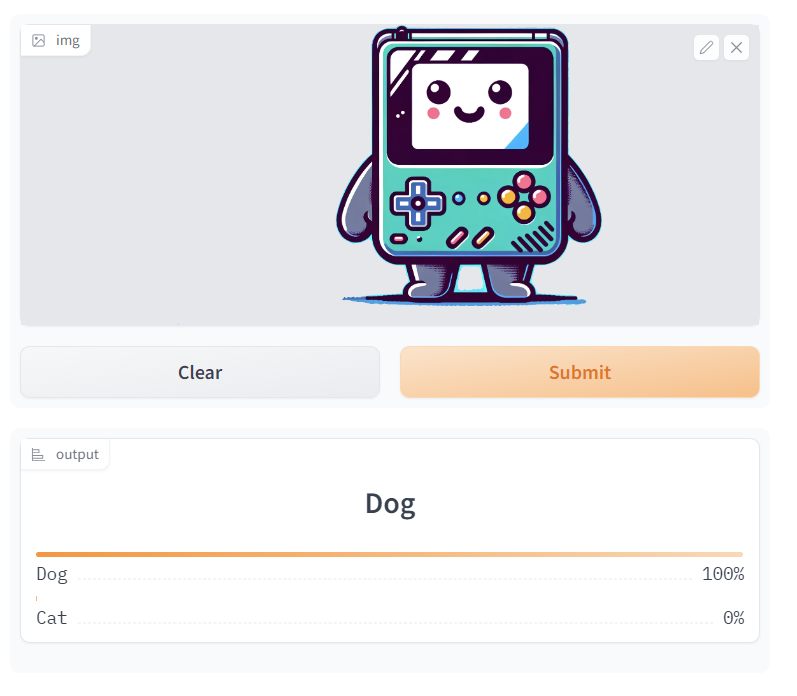
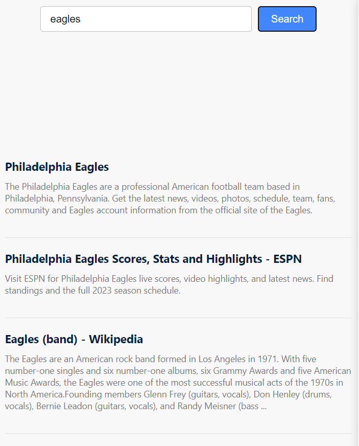
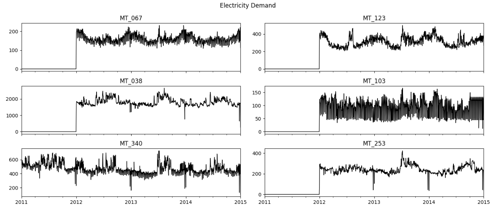

# The DataScientist Cookbook
---
## Neural Networks

### Practical Deep Learning for Coders - fast.ai

My implementation of code and projects in [***Practical Deep Learning for Coders***](https://course.fast.ai/) by Jeremy Howard.

**Pet Image Classifier - Fast.ai:** Trained a computer vision image classifier on online search results using the fastai library which identifies images of dogs and cats with ∼95% accuracy. Hosted on HuggingFace Gradio and accessible as a web application. 
 

 

---
## Data Science

### FastSearch - Search with implicit feedback

FastSearch is a web search improvement project that utilizes active learning to re-rank search results based on user engagement, aiming to increase click-through rates. It collects data from Bing, employs machine learning to classify relevant results, with the whole code written in javascript and is hosted on Glitch, with future plans for precision enhancement and potential expansion to literature review platforms like Google Scholar.

 

 

---
### Time Series Forecasting with DeepAR and PySpark

These notebooks showcases the application of AWS SageMaker's DeepAR algorithm for time series forecasting, integrated with data processing using PySpark. The Jupyter notebook (forecasting_with_deepAR_AWS Summit22.ipynb) covers the entire workflow from data ingestion and preprocessing, through model training, to inference and evaluation. The second notebook (sparkmagic-sentiment-analysis.ipynb) covers the implementation of a simple sentiment analysis project using AWS Blazingtext model. The model was deployed on an endpoint and a real time inference of a text review was evaluated.

 

 

---

© 2023 Raghunandan Ramadass. Powered by Jekyll and the Minimal Theme.

