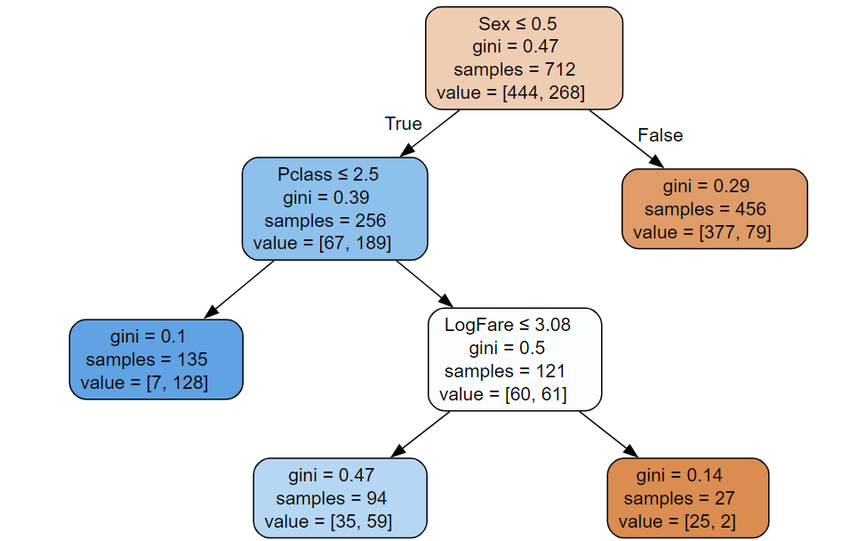
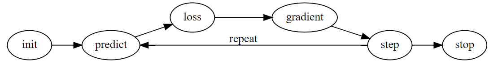
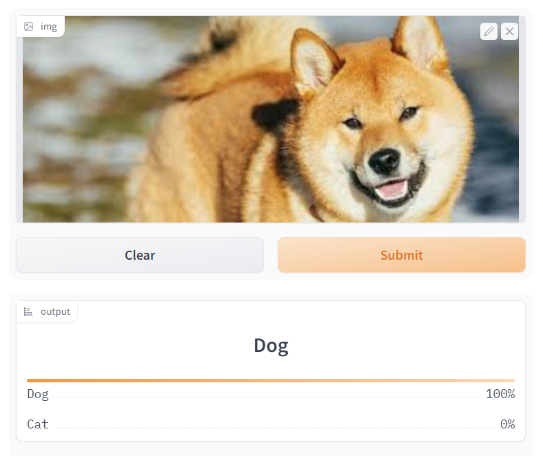

# The DataScientist Cookbook
---
## Neural Networks
My implementation of code and projects in [***Practical Deep Learning for Coders***](https://course.fast.ai/) by Jeremy Howard.

### Random Forest Everything - fast.ai

Using kaggle to implement whatever I've learnt after each chapter, right now at Chapter 7!. In the notebook, I explain the workings of a decision tree and its evolution into a random forest. Random Forest models are a quick and useful experiment for all tabular data, with performance at par with more advanced and complex neural networks!

 

 

---

### Training neural networks from scratch on MNIST - fast.ai

I use kaggle to implement whatever I've learnt after each chapter, right now at Chapter 4!. In the chapter, a neural network was developed from scratch to distingush between 3 and 7 from the MNIST dataset. In this notebook, I implement a model from scratch to classify the whole dataset (0-9, multi-class classification).

 

 

---

### Practical Deep Learning for Coders - fast.ai

 Trained a computer vision image classifier on online search results using the fastai library which identifies images of dogs and cats with ∼95% accuracy. Hosted on HuggingFace and accessible as a web application. 

 

 

---
## Data Science

### FastSearch - Search with implicit feedback

FastSearch is a web search improvement project that utilizes active learning to re-rank search results based on user engagement, aiming to increase click-through rates. It collects data from Bing, employs machine learning to classify relevant results, with the whole code written in javascript and is hosted on Glitch, with future plans for precision enhancement and potential expansion to literature review platforms like Google Scholar.

 

 

---
### Time Series Forecasting with DeepAR and PySpark

These notebooks showcases the application of AWS SageMaker's DeepAR algorithm for time series forecasting, integrated with data processing using PySpark. The Jupyter notebook (forecasting_with_deepAR_AWS Summit22.ipynb) covers the entire workflow from data ingestion and preprocessing, through model training, to inference and evaluation. The second notebook (sparkmagic-sentiment-analysis.ipynb) covers the implementation of a simple sentiment analysis project using AWS Blazingtext model. The model was deployed on an endpoint and a real time inference of a text review was evaluated.

 

 

---

© 2023 Raghunandan Ramadass. Powered by Jekyll and the Minimal Theme.

